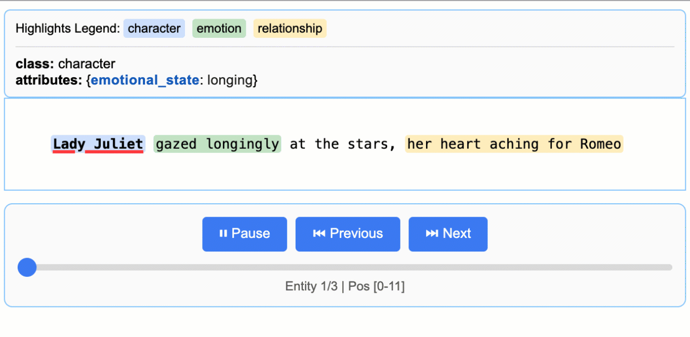

# LangCore

## Overview

**LangCore** is a Python library for LLM-powered structured information extraction from unstructured text. It is built on top of Google's open-source [LangCore](https://github.com/ignatg/langcore) library (Apache 2.0), extending it with additional capabilities for production  document processing workflows.

> **Attribution:** The core extraction engine is derived from [LangCore by Google LLC](https://github.com/ignatg/langcore). See the [NOTICE](NOTICE) file for full attribution details.

## Table of Contents

- [Overview](#overview)
- [What's Added Over LangCore](#whats-added-over-langcore)
- [Core Capabilities](#core-capabilities)
- [Feature Comparison](#feature-comparison)
- [Quick Start](#quick-start)
- [Schema-First Extraction with Pydantic](#schema-first-extraction-with-pydantic)
- [Confidence Scoring](#confidence-scoring)
- [Extraction Hooks & Events](#extraction-hooks--events)
- [Quality Metrics & Evaluation](#quality-metrics--evaluation)
- [Installation](#installation)
- [API Key Setup for Cloud Models](#api-key-setup-for-cloud-models)
- [Adding Custom Model Providers](#adding-custom-model-providers)
- [Using OpenAI Models](#using-openai-models)
- [Using Local LLMs with Ollama](#using-local-llms-with-ollama)
- [More Examples](#more-examples)
- [Ecosystem Plugins](#ecosystem-plugins)
- [Contributing](#contributing)
- [Testing](#testing)
- [License](#license)

## What's Added Over LangCore

LangCore extends Google's LangCore with the following features:

| Feature | Description |
|---|---|
| **Pydantic Schema Extraction** | Define extraction targets as Pydantic models with auto-generated prompts and JSON schema constraints (`schema_adapter`, `schema_generator`) |
| **Confidence Scoring** | Per-extraction confidence (0.0–1.0) combining alignment quality + token overlap, with configurable weights |
| **Extraction Hooks & Events** | 6 lifecycle events (`extraction:start`, `chunk`, `llm_call`, `alignment`, `complete`, `error`) with fault-tolerant callbacks |
| **Quality Metrics & Evaluation** | Built-in P/R/F1/accuracy metrics with per-field and per-document breakdown |
| **Multi-pass Confidence** | Cross-pass frequency augmentation for higher-confidence extractions |
| **Prompt Alignment Validation** | Warnings when few-shot examples contain non-verbatim text |
| **Plugin Ecosystem** | 8 first-party plugins: LiteLLM, audit, guardrails, hybrid, DSPy, RAG, Docling, and API — see [Ecosystem Plugins](#ecosystem-plugins) |

## Core Capabilities

1. **Precise Source Grounding:** Maps every extraction to its exact location in the source text, enabling visual highlighting for easy traceability and verification.
2. **Reliable Structured Outputs:** Enforces a consistent output schema based on your few-shot examples, leveraging controlled generation in supported models like Gemini to guarantee robust, structured results.
3. **Optimized for Long Documents:** Overcomes the "needle-in-a-haystack" challenge of large document extraction by using an optimized strategy of text chunking, parallel processing, and multiple passes for higher recall.
4. **Interactive Visualization:** Instantly generates a self-contained, interactive HTML file to visualize and review thousands of extracted entities in their original context.
5. **Flexible LLM Support:** Supports your preferred models, from cloud-based LLMs like the Google Gemini family to local open-source models via the built-in Ollama interface.
6. **Adaptable to Any Domain:** Define extraction tasks for any domain using just a few examples — no model fine-tuning required.
7. **Leverages LLM World Knowledge:** Utilize precise prompt wording and few-shot examples to influence how the extraction task may utilize LLM knowledge.

## Feature Comparison

How LangCore and its plugin ecosystem compare to [LangStruct](https://github.com/langstruct/langstruct), [Instructor](https://github.com/jxnl/instructor), and [Guardrails AI](https://github.com/guardrails-ai/guardrails).

### Core Extraction Capabilities

| Feature | LangCore | LangStruct | Instructor | Guardrails AI |
|---|---|---|---|---|
| **Structured extraction from text** | ✅ Few-shot + prompt-driven | ✅ Schema-driven | ✅ Pydantic response model | ⚠️ Guard wrapping |
| **Source grounding / alignment** | ✅ Exact span mapping with char offsets | ❌ | ❌ | ❌ |
| **Long document chunking** | ✅ Optimized chunking + parallel processing | ⚠️ Basic chunking | ❌ | ❌ |
| **Multi-pass extraction** | ✅ Configurable `extraction_passes` for higher recall | ❌ | ❌ | ❌ |
| **Interactive HTML visualization** | ✅ Built-in entity-in-context viewer | ❌ | ❌ | ❌ |
| **URL/file document input** | ✅ Accepts URLs, file paths, and raw text | ❌ | ❌ | ❌ |
| **Batch API support** | ✅ Vertex AI Batch API | ❌ | ❌ | ❌ |

### Schema & Typing

| Feature | LangCore | LangStruct | Instructor | Guardrails AI |
|---|---|---|---|---|
| **Pydantic schema extraction** | ✅ `schema=MyModel` with auto-prompt generation | ✅ Native | ✅ Native response model | ⚠️ Via Pydantic integration |
| **Schema validation retry** | ✅ `schema_validation_retries=N` — validate → re-ask loop | ❌ | ✅ Auto retry on Pydantic failure | ⚠️ Via Guard wrapping |
| **Few-shot examples** | ✅ `ExampleData` with text + extractions | ⚠️ Limited | ❌ | ❌ |
| **Pydantic ↔ ExampleData bridge** | ✅ `to_pydantic()` / `schema_from_pydantic()` | ❌ | N/A | N/A |
| **Schema from dict** | ✅ `schema_from_example({"key": "val"})` | ❌ | ❌ | ❌ |
| **Controlled generation** | ✅ JSON schema constraints via supported models | ⚠️ | ⚠️ Mode-dependent | ❌ |
| **Union type support** | ❌ | ❌ | ✅ `Union[A, B]` | ❌ |

### Confidence & Quality

| Feature | LangCore | LangStruct | Instructor | Guardrails AI |
|---|---|---|---|---|
| **Confidence scoring** | ✅ Per-extraction (alignment quality + token overlap) | ❌ | ❌ | ❌ |
| **Document-level confidence** | ✅ `result.average_confidence` | ❌ | ❌ | ❌ |
| **Multi-pass confidence boost** | ✅ Cross-pass frequency augmentation | ❌ | ❌ | ❌ |
| **Prompt alignment validation** | ✅ Warnings for non-verbatim examples | ❌ | ❌ | ❌ |

### Hooks & Observability

| Feature | LangCore | LangStruct | Instructor | Guardrails AI |
|---|---|---|---|---|
| **Event hook system** | ✅ 6 lifecycle events via `Hooks` class | ❌ | ✅ `completion:kwargs`, `parse:error` etc. | ❌ |
| **Global hooks** | ✅ `lx.configure(hooks=...)` | ❌ | ❌ | ❌ |
| **Hook composition** | ✅ Merge with `hooks_a + hooks_b` | ❌ | ❌ | ❌ |
| **Fault-tolerant callbacks** | ✅ Exceptions logged & swallowed | ❌ | ❌ | ❌ |
| **Token usage tracking** | ⚠️ Via API layer | ❌ | ✅ `response.usage` | ❌ |

### Validation & Guardrails (`langcore-guardrails` plugin)

| Feature | LangCore + Guardrails | LangStruct | Instructor | Guardrails AI |
|---|---|---|---|---|
| **Validation + retry loop** | ✅ Corrective prompts with error feedback | ❌ | ✅ Auto retry on Pydantic failure | ✅ Guard wrapping with retry |
| **Pydantic schema validation** | ✅ `SchemaValidator` — strict or coercive | ❌ | ✅ Native | ⚠️ Via integration |
| **JSON Schema validation** | ✅ `JsonSchemaValidator` with strict mode | ❌ | ❌ | ✅ JSON Schema guard |
| **Confidence threshold** | ✅ `ConfidenceThresholdValidator` | ❌ | ❌ | ❌ |
| **Field completeness** | ✅ `FieldCompletenessValidator` | ❌ | ❌ | ⚠️ Custom validators |
| **Consistency rules** | ✅ `ConsistencyValidator` | ❌ | ❌ | ⚠️ Custom validators |
| **Regex validation** | ✅ `RegexValidator` | ❌ | ❌ | ✅ Regex guard |
| **On-fail actions** | ✅ `EXCEPTION` / `REASK` / `FILTER` / `NOOP` | ❌ | ⚠️ Exception only | ✅ `EXCEPTION` / `REASK` / `FIX` / `NOOP` |
| **Validator registry** | ✅ `@register_validator` decorator | ❌ | ❌ | ✅ Hub (67+ validators) |
| **Validator chaining** | ✅ `ValidatorChain` with per-validator actions | ❌ | ❌ | ✅ Guard chaining |
| **Error-only correction mode** | ✅ Omit invalid output from retry prompt | ❌ | ❌ | ❌ |
| **Batch-independent retries** | ✅ Each prompt retries independently | ❌ | ❌ | ❌ |
| **Async concurrency control** | ✅ `max_concurrency` semaphore | ❌ | ✅ | ❌ |

### DSPy Prompt Optimization (`langcore-dspy` plugin)

| Feature | LangCore + DSPy | LangStruct | Instructor | Guardrails AI |
|---|---|---|---|---|
| **MIPROv2 optimizer** | ✅ Fast, general-purpose | ✅ | ❌ | ❌ |
| **GEPA optimizer** | ✅ Reflective / feedback-driven | ✅ | ❌ | ❌ |
| **Persist optimized configs** | ✅ `save()` / `load()` to directory | ✅ | ❌ | ❌ |
| **Evaluation (P/R/F1)** | ✅ `evaluate()` with per-document details | ⚠️ Basic | ❌ | ❌ |
| **Native pipeline integration** | ✅ `optimized_config` param in `extract()` | ❌ Separate pipeline | ❌ | ❌ |

### Model Support

| Feature | LangCore | LangStruct | Instructor | Guardrails AI |
|---|---|---|---|---|
| **Google Gemini** | ✅ Built-in | ❌ | ✅ | ✅ |
| **OpenAI / GPT** | ✅ Via providers | ❌ | ✅ Native | ✅ |
| **Local LLMs (Ollama)** | ✅ Built-in | ❌ | ⚠️ Via patches | ❌ |
| **LiteLLM (100+ models)** | ✅ Via `langcore-litellm` | ✅ | ❌ | ✅ |
| **Custom model providers** | ✅ `BaseLanguageModel` ABC | ❌ | ❌ | ❌ |
| **Community provider plugins** | ✅ Plugin registry | ❌ | ❌ | ❌ |

### Async & Performance

| Feature | LangCore | LangStruct | Instructor | Guardrails AI |
|---|---|---|---|---|
| **Async extraction** | ✅ `async_extract()` | ⚠️ | ✅ | ⚠️ |
| **Parallel workers** | ✅ `max_workers` for concurrent chunk processing | ❌ | ❌ | ❌ |
| **Response caching** | ✅ Built-in with cache-busting for multi-pass | ⚠️ | ✅ | ❌ |

### Quality Metrics & Evaluation

| Feature | LangCore | LangStruct | Instructor | Guardrails AI |
|---|---|---|---|---|
| **Precision / Recall / F1** | ✅ `ExtractionMetrics` static helpers + `.evaluate()` | ✅ `ExtractionMetrics` | ❌ | ❌ |
| **Accuracy (exact-match ratio)** | ✅ | ✅ | ❌ | ❌ |
| **Per-field breakdown** | ✅ `FieldReport` per schema field | ⚠️ Basic | ❌ | ❌ |
| **Per-document breakdown** | ✅ Per-document P/R/F1 dicts | ❌ | ❌ | ❌ |
| **Pydantic schema integration** | ✅ `ExtractionMetrics(schema=Invoice)` | ❌ | ❌ | ❌ |
| **Strict attribute matching** | ✅ `strict_attributes=True` | ❌ | ❌ | ❌ |
| **Averaging modes** | ✅ Macro / micro / weighted | ❌ | ❌ | ❌ |
| **Fuzzy matching** | ✅ `fuzzy_threshold` (difflib SequenceMatcher) | ❌ | ❌ | ❌ |
| **Top-level convenience** | ✅ `lx.evaluate()` | ❌ | ❌ | ❌ |

### RAG Query Parsing (`langcore-rag` plugin)

| Feature | LangCore + RAG | LangStruct | Instructor | Guardrails AI |
|---|---|---|---|---|
| **Query → semantic terms + filters** | ✅ `QueryParser.parse()` | ✅ `.query()` | ❌ | ❌ |
| **Async parsing** | ✅ `async_parse()` | ✅ | ❌ | ❌ |
| **Pydantic schema introspection** | ✅ Auto-discovers filterable fields | ✅ | ❌ | ❌ |
| **MongoDB-style operators** | ✅ `$eq`, `$gte`, `$lte`, `$in`, etc. | ✅ | ❌ | ❌ |
| **Parse confidence score** | ✅ 0.0 – 1.0 | ❌ | ❌ | ❌ |
| **Explanation / rationale** | ✅ Human-readable | ❌ | ❌ | ❌ |
| **Query caching (LRU)** | ✅ `cache_maxsize` parameter | ❌ | ❌ | ❌ |
| **Jupyter-safe sync bridge** | ✅ `parse_sync_from_async()` | ❌ | ❌ | ❌ |
| **Any LLM backend** | ✅ Via LiteLLM (100+ providers) | ✅ | ❌ | ❌ |

## Quick Start

> **Note:** Using cloud-hosted models like Gemini requires an API key. See the [API Key Setup](#api-key-setup-for-cloud-models) section for instructions on how to get and configure your key.

Extract structured information with just a few lines of code.

### 1. Define Your Extraction Task

First, create a prompt that clearly describes what you want to extract. Then, provide a high-quality example to guide the model.

```python
import langcore as lx
import textwrap

# 1. Define the prompt and extraction rules
prompt = textwrap.dedent("""\
    Extract characters, emotions, and relationships in order of appearance.
    Use exact text for extractions. Do not paraphrase or overlap entities.
    Provide meaningful attributes for each entity to add context.""")

# 2. Provide a high-quality example to guide the model
examples = [
    lx.data.ExampleData(
        text="ROMEO. But soft! What light through yonder window breaks? It is the east, and Juliet is the sun.",
        extractions=[
            lx.data.Extraction(
                extraction_class="character",
                extraction_text="ROMEO",
                attributes={"emotional_state": "wonder"}
            ),
            lx.data.Extraction(
                extraction_class="emotion",
                extraction_text="But soft!",
                attributes={"feeling": "gentle awe"}
            ),
            lx.data.Extraction(
                extraction_class="relationship",
                extraction_text="Juliet is the sun",
                attributes={"type": "metaphor"}
            ),
        ]
    )
]
```

> **Note:** Examples drive model behavior. Each `extraction_text` should ideally be verbatim from the example's `text` (no paraphrasing), listed in order of appearance. LangCore raises `Prompt alignment` warnings by default if examples don't follow this pattern—resolve these for best results.

### 2. Run the Extraction

Provide your input text and the prompt materials to the `lx.extract` function.

```python
# The input text to be processed
input_text = "Lady Juliet gazed longingly at the stars, her heart aching for Romeo"

# Run the extraction
result = lx.extract(
    text_or_documents=input_text,
    prompt_description=prompt,
    examples=examples,
    model_id="gemini-2.5-flash",
)
```

> **Model Selection**: `gemini-2.5-flash` is the recommended default, offering an excellent balance of speed, cost, and quality. For highly complex tasks requiring deeper reasoning, `gemini-2.5-pro` may provide superior results. For large-scale or production use, a Tier 2 Gemini quota is suggested to increase throughput and avoid rate limits. See the [rate-limit documentation](https://ai.google.dev/gemini-api/docs/rate-limits#tier-2) for details.
>
> **Model Lifecycle**: Note that Gemini models have a lifecycle with defined retirement dates. Users should consult the [official model version documentation](https://cloud.google.com/vertex-ai/generative-ai/docs/learn/model-versions) to stay informed about the latest stable and legacy versions.

### 3. Visualize the Results

The extractions can be saved to a `.jsonl` file, a popular format for working with language model data. LangCore can then generate an interactive HTML visualization from this file to review the entities in context.

```python
# Save the results to a JSONL file
lx.io.save_annotated_documents([result], output_name="extraction_results.jsonl", output_dir=".")

# Generate the visualization from the file
html_content = lx.visualize("extraction_results.jsonl")
with open("visualization.html", "w") as f:
    if hasattr(html_content, 'data'):
        f.write(html_content.data)  # For Jupyter/Colab
    else:
        f.write(html_content)
```

This creates an animated and interactive HTML file:



> **Note on LLM Knowledge Utilization:** This example demonstrates extractions that stay close to the text evidence - extracting "longing" for Lady Juliet's emotional state and identifying "yearning" from "gazed longingly at the stars." The task could be modified to generate attributes that draw more heavily from the LLM's world knowledge (e.g., adding `"identity": "Capulet family daughter"` or `"literary_context": "tragic heroine"`). The balance between text-evidence and knowledge-inference is controlled by your prompt instructions and example attributes.

### Scaling to Longer Documents

For larger texts, you can process entire documents directly from URLs with parallel processing and enhanced sensitivity:

```python
# Process Romeo & Juliet directly from Project Gutenberg
result = lx.extract(
    text_or_documents="https://www.gutenberg.org/files/1513/1513-0.txt",
    prompt_description=prompt,
    examples=examples,
    model_id="gemini-2.5-flash",
    extraction_passes=3,    # Improves recall through multiple passes
    max_workers=20,         # Parallel processing for speed
    max_char_buffer=1000    # Smaller contexts for better accuracy
)
```

> **Multi-pass & caching:** When `extraction_passes > 1`, the first pass uses
> normal caching behaviour while subsequent passes include a `pass_num` keyword
> argument that providers can use to bypass response caches. The
> [langcore-litellm](https://github.com/JustStas/langcore-litellm)
> provider does this automatically — passes ≥ 2 always hit the live LLM API.

This approach can extract hundreds of entities from full novels while maintaining high accuracy. The interactive visualization seamlessly handles large result sets, making it easy to explore hundreds of entities from the output JSONL file. **[See the full *Romeo and Juliet* extraction example →](docs/examples/longer_text_example.md)** for detailed results and performance insights.

### Vertex AI Batch Processing

Save costs on large-scale tasks by enabling Vertex AI Batch API: `language_model_params={"vertexai": True, "batch": {"enabled": True}}`.

See an example of the Vertex AI Batch API usage in [this example](docs/examples/batch_api_example.md).

### Schema-First Extraction with Pydantic

Instead of manually constructing `ExampleData` objects, you can define your extraction schema as a Pydantic model. LangCore will auto-generate the prompt and schema constraints for you.

```python
from pydantic import BaseModel, Field
import langcore as lx

class Invoice(BaseModel):
    invoice_number: str = Field(description="Invoice ID like INV-001")
    amount: float = Field(description="Total amount in dollars")
    due_date: str = Field(description="Due date in YYYY-MM-DD format")

result = lx.extract(
    text="Invoice INV-2024-789 for $3,450 is due April 20th, 2024",
    schema=Invoice,
    model_id="gemini-2.5-flash",
)

# Convert extractions back to typed Pydantic instances
invoices = result.to_pydantic(Invoice)
for inv in invoices:
    print(f"{inv.invoice_number}: ${inv.amount} due {inv.due_date}")
```

You can also combine `schema` with explicit `examples` for the best of both worlds — the Pydantic model defines the structure, and examples provide few-shot guidance:

```python
result = lx.extract(
    text="...",
    schema=Invoice,
    examples=[
        lx.data.ExampleData(
            text="Invoice INV-001 for $100 due Jan 1, 2024",
            extractions=[
                lx.data.Extraction(
                    extraction_class="Invoice",
                    extraction_text="INV-001",
                    attributes={"amount": "100.0", "due_date": "2024-01-01"},
                )
            ],
        )
    ],
    model_id="gemini-2.5-flash",
)
```

> **Tip:** Use `lx.schema_from_pydantic(Invoice)` to inspect the auto-generated prompt and JSON schema before running extraction. Use `lx.schema_from_example({"name": "John", "age": 30})` to auto-generate a Pydantic model from a plain dict, or `lx.schema_from_examples([{"name": "John"}, {"name": "Jane", "age": 30}])` to merge multiple examples (fields default to optional when absent from some examples).

> **Under the hood:** The `PydanticSchemaAdapter` converts your Pydantic model into LangCore's internal `SchemaConfig` — auto-generating the prompt description, JSON schema, and seed examples. You can use it directly for advanced scenarios: `from langcore.pydantic_schema import PydanticSchemaAdapter`.

#### Schema Validation Retries

When using Pydantic schema mode, you can enable automatic validation retries with `schema_validation_retries`. After extraction, each result is validated against the schema. Extractions that fail validation trigger a re-extraction with the validation error feedback, following the Instructor-style "validate → re-ask" pattern:

```python
result = lx.extract(
    text="Invoice INV-2024-789 for $3,450 is due April 20th, 2024",
    schema=Invoice,
    model_id="gemini-2.5-flash",
    schema_validation_retries=2,  # Up to 2 retry attempts
)
```

Valid extractions from the first pass are always preserved — only invalid ones are retried. The correction prompt includes the specific Pydantic validation errors so the LLM can fix them.

### Confidence Scoring

Every extraction is automatically assigned a `confidence_score` between 0.0 and 1.0 after alignment. The score is computed by `compute_alignment_confidence()` in the resolver and combines two signals:

- **Alignment quality** (`w_alignment`, default 70%) — how well the extraction text matched the source: exact match = 1.0, lesser = 0.8, greater = 0.7, fuzzy = 0.5, unaligned = 0.2.
- **Token overlap ratio** (`w_overlap`, default 30%) — how many tokens in the extraction text vs. the matched source span.

Both weights are configurable — pass `w_alignment` and `w_overlap` keyword arguments to `compute_alignment_confidence()` to tune the balance for your use case.

```python
result = lx.extract(
    text="Patient Jane Doe received Lisinopril for hypertension.",
    examples=[...],
    model_id="gemini-2.5-flash",
)

for extraction in result.extractions:
    print(f"{extraction.extraction_class}: {extraction.extraction_text} "
          f"(confidence: {extraction.confidence_score})")

# Document-level average confidence
print(f"Average confidence: {result.average_confidence}")
```

For **multi-pass extraction**, confidence is further augmented by cross-pass appearance frequency — extractions confirmed across multiple passes receive higher scores (`cross_pass_ratio × alignment_confidence`).

### Extraction Hooks & Events

The `langcore.hooks` module provides a lightweight event system inspired by
[Instructor](https://python.useinstructor.com/) hooks to inject custom logic at
every stage of the extraction pipeline — without modifying core code.

**Lifecycle events** are defined by the `HookName` enum (you can also use plain strings):

| Event | `HookName` | Fires when | Payload keys |
|---|---|---|---|
| `extraction:start` | `HookName.START` | Pipeline begins (after components are built) | `text`, `examples`, `model_id` |
| `extraction:chunk` | `HookName.CHUNK` | A document chunk has been processed | `chunk_index`, `num_chunks`, `chunk_text`, `extractions` |
| `extraction:llm_call` | `HookName.LLM_CALL` | An LLM inference call completes | `prompt`, `response` |
| `extraction:alignment` | `HookName.ALIGNMENT` | Extraction alignment is performed | `extractions` |
| `extraction:complete` | `HookName.COMPLETE` | Pipeline finishes successfully | `result` |
| `extraction:error` | `HookName.ERROR` | An exception is raised | `error` |

**Quick example:**

```python
from langcore.hooks import Hooks, HookName

hooks = Hooks()
hooks.on(HookName.START, lambda payload: print("Starting extraction…"))
hooks.on(HookName.LLM_CALL, lambda payload: print(f"LLM responded"))
hooks.on(HookName.ERROR, lambda payload: alert_team(payload["error"]))

result = lx.extract(
    text="Patient received Lisinopril 10mg daily.",
    examples=[...],
    model_id="gemini-2.5-flash",
    hooks=hooks,
)
```

**Programmatic emission** — use `emit()` (sync) or `async_emit()` (async) to fire
events from your own code or custom providers:

```python
hooks.emit("extraction:start", {"text": "hello", "model_id": "gpt-4o"})

# In async contexts, async_emit() awaits coroutine handlers
await hooks.async_emit("extraction:complete", {"result": result})
```

**Composing hooks** — merge two `Hooks` instances with `+`:

```python
logging_hooks = Hooks().on("extraction:llm_call", log_llm_call)
metrics_hooks = Hooks().on("extraction:complete", record_metrics)
combined = logging_hooks + metrics_hooks
```

**Removing handlers** — use `off()` to remove a specific handler, or `clear()` to remove all:

```python
hooks.off(HookName.LLM_CALL, log_llm_call)
hooks.clear()
```

Callbacks are **fault-tolerant**: if a handler raises an exception it is logged
and swallowed so it never breaks the extraction pipeline.

**Global hooks via `lx.configure()`** — set hooks once and they apply to every
`extract()` / `async_extract()` call without passing `hooks=` each time:

```python
import langcore as lx
from langcore.hooks import Hooks, HookName

# Set up global observability hooks once at startup
global_hooks = Hooks()
global_hooks.on(HookName.EXTRACTION_START, lambda cfg: print("Starting:", cfg["model_id"]))
global_hooks.on(HookName.EXTRACTION_ERROR, lambda err: alert_team(err))
lx.configure(hooks=global_hooks)

# Every extract() call now emits to global hooks automatically
result = lx.extract(text="...", examples=[...])

# Per-call hooks still work and fire AFTER global hooks
per_call = Hooks().on(HookName.EXTRACTION_COMPLETE, lambda r: log_result(r))
result = lx.extract(text="...", examples=[...], hooks=per_call)

# Inspect or reset global config
lx.get_config()   # {"hooks": <Hooks instance>}
lx.reset()         # Clears all global configuration
```

### Quality Metrics & Evaluation

The `langcore.evaluation` module provides built-in quality metrics for measuring extraction accuracy against ground truth. Compute precision, recall, F1, and accuracy at both the extraction level and per-field level.

```python
from langcore.evaluation import ExtractionMetrics

# Quick static helpers
print(ExtractionMetrics.f1(predictions=results, ground_truth=expected))
print(ExtractionMetrics.precision(predictions=results, ground_truth=expected))
```

**Full evaluation with per-field breakdown** — pass a Pydantic schema for field-level metrics:

```python
from pydantic import BaseModel, Field
from langcore.evaluation import ExtractionMetrics

class Invoice(BaseModel):
    invoice_number: str = Field(description="Invoice ID")
    amount: str = Field(description="Total amount")
    due_date: str = Field(description="Due date YYYY-MM-DD")

metrics = ExtractionMetrics(schema=Invoice)
report = metrics.evaluate(predictions=results, ground_truth=expected)
print(report.f1)          # 0.92
print(report.per_field)   # {"invoice_number": FieldReport(...), "amount": ...}
```

**Convenience function** — `lx.evaluate()` wraps `ExtractionMetrics` for quick one-liners:

```python
import langcore as lx

report = lx.evaluate(predictions=results, ground_truth=expected, schema=Invoice)
```

**Averaging modes** — control how multi-document metrics are aggregated:

```python
from langcore.evaluation import ExtractionMetrics

# Macro (default) — pool all extractions, compute P/R/F1 once
metrics = ExtractionMetrics(schema=Invoice, averaging="macro")

# Micro — compute P/R/F1 per document, then take unweighted mean
metrics = ExtractionMetrics(schema=Invoice, averaging="micro")

# Weighted — per-document P/R/F1 weighted by ground-truth count
metrics = ExtractionMetrics(schema=Invoice, averaging="weighted")
```

**Fuzzy matching** — allow near-matches instead of exact string equality:

```python
# Match extractions with ≥80% string similarity (difflib.SequenceMatcher)
metrics = ExtractionMetrics(fuzzy_threshold=0.8)
report = metrics.evaluate(predictions=results, ground_truth=expected)

# Also available via lx.evaluate()
import langcore as lx
report = lx.evaluate(predictions=results, ground_truth=expected, fuzzy_threshold=0.8)
```

The `EvaluationReport` includes:

- Aggregate `precision`, `recall`, `f1`, `accuracy`
- `averaging` — the strategy used (`"macro"`, `"micro"`, or `"weighted"`)
- `per_document` — list of per-document metric dicts
- `per_field` — dict of `FieldReport` objects with field-level P/R/F1 and support counts
- `strict_attributes=True` mode for matching on attribute values (not just class + text)

## Installation

### From Source

LangCore uses modern Python packaging with `pyproject.toml` for dependency management:

```bash
git clone https://github.com/IgnatG/langcore.git
cd langcore

# For basic installation:
pip install -e .

# For development (includes linting tools):
pip install -e ".[dev]"

# For testing (includes pytest):
pip install -e ".[test]"
```

### Docker

```bash
docker build -t langcore .
docker run --rm -e LANGCORE_API_KEY="your-api-key" langcore python your_script.py
```

## API Key Setup for Cloud Models

When using LangCore with cloud-hosted models (like Gemini or OpenAI), you'll need to
set up an API key. On-device models don't require an API key. For developers
using local LLMs, LangCore offers built-in support for Ollama and can be
extended to other third-party APIs by updating the inference endpoints.

### API Key Sources

Get API keys from:

- [AI Studio](https://aistudio.google.com/app/apikey) for Gemini models
- [Vertex AI](https://cloud.google.com/vertex-ai/generative-ai/docs/sdks/overview) for enterprise use
- [OpenAI Platform](https://platform.openai.com/api-keys) for OpenAI models

### Setting up API key in your environment

**Option 1: Environment Variable**

```bash
export LANGCORE_API_KEY="your-api-key-here"
```

**Option 2: .env File (Recommended)**

Add your API key to a `.env` file:

```bash
# Add API key to .env file
cat >> .env << 'EOF'
LANGCORE_API_KEY=your-api-key-here
EOF

# Keep your API key secure
echo '.env' >> .gitignore
```

In your Python code:

```python
import langcore as lx

result = lx.extract(
    text_or_documents=input_text,
    prompt_description="Extract information...",
    examples=[...],
    model_id="gemini-2.5-flash"
)
```

**Option 3: Direct API Key (Not Recommended for Production)**

You can also provide the API key directly in your code, though this is not recommended for production use:

```python
result = lx.extract(
    text_or_documents=input_text,
    prompt_description="Extract information...",
    examples=[...],
    model_id="gemini-2.5-flash",
    api_key="your-api-key-here"  # Only use this for testing/development
)
```

**Option 4: Vertex AI (Service Accounts)**

Use [Vertex AI](https://cloud.google.com/vertex-ai/docs/start/introduction-unified-platform) for authentication with service accounts:

```python
result = lx.extract(
    text_or_documents=input_text,
    prompt_description="Extract information...",
    examples=[...],
    model_id="gemini-2.5-flash",
    language_model_params={
        "vertexai": True,
        "project": "your-project-id",
        "location": "global"  # or regional endpoint
    }
)
```

## Adding Custom Model Providers

LangCore supports custom LLM providers via a lightweight plugin system. You can add support for new models without changing core code.

- Add new model support independently of the core library
- Distribute your provider as a separate Python package
- Keep custom dependencies isolated
- Override or extend built-in providers via priority-based resolution

See the detailed guide in [Provider System Documentation](langcore/providers/README.md) to learn how to:

- Register a provider with `@registry.register(...)`
- Publish an entry point for discovery
- Optionally provide a schema with `get_schema_class()` for structured output
- Integrate with the factory via `create_model(...)`

## Using OpenAI Models

LangCore supports OpenAI models (requires optional dependency: `pip install langcore[openai]`):

```python
import langcore as lx

result = lx.extract(
    text_or_documents=input_text,
    prompt_description=prompt,
    examples=examples,
    model_id="gpt-4o",  # Automatically selects OpenAI provider
    api_key=os.environ.get('OPENAI_API_KEY'),
    fence_output=True,
    use_schema_constraints=False
)
```

Note: OpenAI models require `fence_output=True` and `use_schema_constraints=False` because LangCore doesn't implement schema constraints for OpenAI yet.

## Using Local LLMs with Ollama

LangCore supports local inference using Ollama, allowing you to run models without API keys:

```python
import langcore as lx

result = lx.extract(
    text_or_documents=input_text,
    prompt_description=prompt,
    examples=examples,
    model_id="gemma2:2b",  # Automatically selects Ollama provider
    model_url="http://localhost:11434",
    fence_output=False,
    use_schema_constraints=False
)
```

**Quick setup:** Install Ollama from [ollama.com](https://ollama.com/), run `ollama pull gemma2:2b`, then `ollama serve`.

For detailed installation, Docker setup, and examples, see [`examples/ollama/`](examples/ollama/).

## More Examples

Additional examples of LangCore in action:

### *Romeo and Juliet* Full Text Extraction

LangCore can process complete documents directly from URLs. This example demonstrates extraction from the full text of *Romeo and Juliet* from Project Gutenberg (147,843 characters), showing parallel processing, sequential extraction passes, and performance optimization for long document processing.

**[View *Romeo and Juliet* Full Text Example →](docs/examples/longer_text_example.md)**

### Medication Extraction

> **Disclaimer:** This demonstration is for illustrative purposes of LangCore's baseline capability only. It does not represent a finished or approved product, is not intended to diagnose or suggest treatment of any disease or condition, and should not be used for medical advice.

LangCore excels at extracting structured medical information from clinical text. These examples demonstrate both basic entity recognition (medication names, dosages, routes) and relationship extraction (connecting medications to their attributes), showing LangCore's effectiveness for healthcare applications.

**[View Medication Examples →](docs/examples/medication_examples.md)**

### Radiology Report Structuring: RadExtract

Explore RadExtract, a live interactive demo on HuggingFace Spaces that shows how LangCore can automatically structure radiology reports. Try it directly in your browser with no setup required.

**[View RadExtract Demo →](https://huggingface.co/spaces/google/radextract)**

## Ecosystem Plugins

LangCore has a growing ecosystem of first-party plugins:

| Plugin | PyPI | Description |
|---|---|---|
| [langcore-litellm](../langcore-litellm/) | [](https://pypi.org/project/langcore-litellm/) | Provider plugin for 100+ LLM backends via LiteLLM (OpenAI, Gemini, Anthropic, Azure, Ollama, etc.) |
| [langcore-audit](../langcore-audit/) | [](https://pypi.org/project/langcore-audit/) | Provider plugin for structured audit logging with pluggable sinks (logging, JSONL, OpenTelemetry) |
| [langcore-guardrails](../langcore-guardrails/) | [](https://pypi.org/project/langcore-guardrails/) | Provider plugin for output validation and automatic retry with corrective prompts |
| [langcore-hybrid](../langcore-hybrid/) | [](https://pypi.org/project/langcore-hybrid-llm-regex/) | Provider plugin for deterministic rule-based extraction with LLM fallback |
| [langcore-dspy](../langcore-dspy/) | [](https://pypi.org/project/langcore-dspy/) | Plugin for automatic prompt optimization using DSPy (MIPROv2, GEPA) |
| [langcore-rag](../langcore-rag/) | [](https://pypi.org/project/langcore-rag/) | Plugin for RAG query parsing — decomposes queries into semantic terms and structured filters |
| [langcore-docling](../langcore-docling/) | [](https://pypi.org/project/langcore-docling/) | Plugin for native PDF support via Docling — drop-in replacement for `lx.extract()` |
| [langcore-api](../langcore-api/) | [](https://pypi.org/project/langcore-api/) | Production-ready HTTP service wrapping the full LangCore ecosystem (FastAPI + Celery + Redis) |

For detailed instructions on creating a provider plugin, see the [Custom Provider Plugin Example](examples/custom_provider_plugin/).

## Contributing

Contributions are welcome! See [CONTRIBUTING.md](CONTRIBUTING.md) to get started
with development, testing, and pull requests.

## Testing

```bash
# Install with test dependencies
pip install -e ".[test]"

# Run all tests
pytest tests
```

Or reproduce the full CI matrix locally with tox:

```bash
tox
```

### Ollama Integration Testing

If you have Ollama installed locally, you can run integration tests:

```bash
# Test Ollama integration (requires Ollama running with gemma2:2b model)
tox -e ollama-integration
```

## Development

### Code Formatting

```bash
# Auto-format all code
./autoformat.sh

# Or run formatters separately
isort langcore tests --profile google --line-length 80
pyink langcore tests --config pyproject.toml
```

### Pre-commit Hooks

```bash
pre-commit install  # One-time setup
pre-commit run --all-files  # Manual run
```

### Linting

```bash
pylint --rcfile=.pylintrc langcore tests
```

See [CONTRIBUTING.md](CONTRIBUTING.md) for full development guidelines.

## License

Licensed under the Apache License, Version 2.0. See [LICENSE](LICENSE) for full terms.

This project includes code originally developed by Google LLC as [LangCore](https://github.com/ignatg/langcore). See [NOTICE](NOTICE) for attribution details.

---

**Happy Extracting!**
